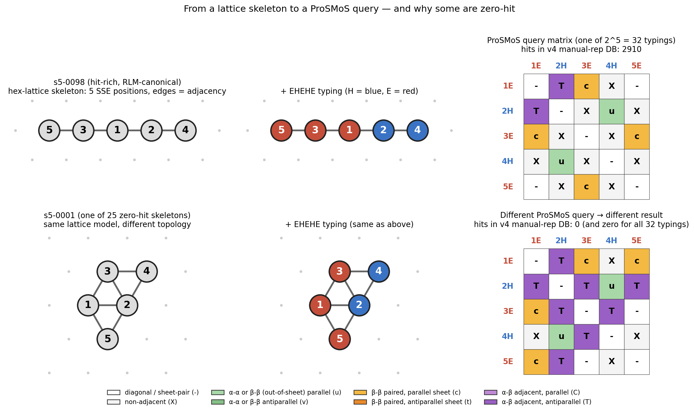
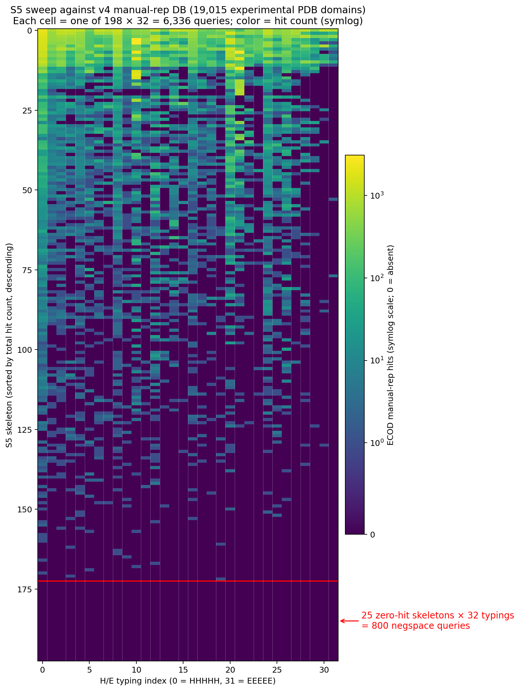

# Enumerated S5 negative space

## What the 2D-hex-lattice SSP model can *make* — and what nature does not

*We enumerated every 5-SSE arrangement the Chitturi 2016 lattice permits (198 skeletons × 32 H/E typings = 6,336 queries), asked whether each occurs as a substructure of any protein, and found 25 skeletons — 800 queries — absent from **5.4 million** real and predicted domains. Along the way we found and fixed four latent bugs in ProSMoS searchmatrix.*

<!-- Notes: This is the story arc: enum -> negspace identification against manual reps -> scale-up to full PDB and AFDB -> four bugs found and fixed -> the definitive claim. The last half of the deck is currently in-flight full-6336 sweeps that give the paper its landscape figure. -->

---

# The unit of work: a skeleton + a typing = a ProSMoS query

- **Skeleton**: 5 SSE positions on the 2D hex lattice + adjacency + per-triple handedness. 198 unique S5 skeletons after SCC-2 and compactness filters.
- **Typing**: assign H or E to each of the 5 positions. 2⁵ = 32 typings per skeleton.
- **ProSMoS query**: skeleton × typing → interaction matrix with codes for parallel/antiparallel β-pairing, α–α packing, mixed α–β contact.

<!-- Notes: The schematic contrasts hit-rich s5-0098 (RLM-canonical, P5-path) with zero-hit s5-0001 (dense, branched) under the SAME EHEHE typing. The type vector is held constant so the visual difference is purely the skeleton. RLM gets a proper c-code pattern (sheet pairings); zero-hit gets T/X/u codes -- geometry doesn't buy it. -->

---

# The empirical landscape: 198 × 32 hits against 19k curated PDB reps

- Cells = individual queries (6,336). Sorted by skeleton total hits, descending.
- **25 skeletons × 32 typings = 800 negspace queries** — the black block at the bottom.
- Composition gradient visible as vertical bands (strand-rich typings darker).
- Bright vertical stripes at typings 10 & 21: EHEHE Rossmann-type sheets.

<!-- Notes: This is against the 19,015-entry ecod_rep.domain WHERE manual_rep=true set (v4 sweep). Curated, one-rep-per-fold-ish. The 25 zero-hit skeletons is the entry point for the whole rest of the deck. Notice the negspace block is a SHARP boundary at zero, not a gradient. -->

---

# The question — is the gap real or an artifact of curation?

- 19k manual reps is ~4% of experimental PDB-derived ECOD domains, and a vanishing fraction of sequenced protein space.
- **Hypothesis A** — the 25 zero-hit skeletons are just under-sampled by the curated set; they light up when we search broader corpora.
- **Hypothesis B** — the gap is real: these motifs are absent from nature (or absent from *observable* nature — a subtly different thing).

**The test**: run the 800 negspace queries against progressively larger databases.

> The result matters for what we can say. If (A), the enum's negspace is a manifesto of curation gaps. If (B), it's a manifesto of protein space.

<!-- Notes: Set up the falsification. The paper's claim rests on this test coming out (B). The three-DB comparison is the natural experimental design. -->

---

# Three databases, one 800-query corpus

| DB | Entries | Source | Purpose |
|---|---|---|---|
| **ecod_rep manreps** | 18,982 | experimental PDB (curated) | the source of the negspace 25 |
| **pdb_exp** | 496,359 | *all* experimental-PDB-derived ECOD domains | ~27× scale-up in real crystallography |
| **afdb_db** | 4,921,931 | AFDB v4 non-singleton clusters | predicted protein space (~10× on top) |
| **combined** | **~5.4M** | curated + exhaustive + predicted | the strongest empirical scope reachable |

- All three built via the same pipeline: PALSSE SSE assignment → `generateMatrix` → concatenated metamatricesDB.
- `domain_summary.source_type='pdb'` for the middle DB (not `derived_files.domain_source_type` — see next slide).

<!-- Notes: Note the source-type gotcha for the pdb_exp build. `derived_files.domain_source_type` tracks file FORMAT (any .pdb-suffixed file, including AFDB-predicted structures stored as .pdb). Using it as the "experimental" filter contaminated our pdb_exp DB with 74% AFDB predictions in an earlier iteration; fixing it to join through `domain_summary.source_type` gives the clean 496k. This is one of the four things that had to be fixed for the claim to be defensible. -->

---

# The result — 800 queries, 5.4M structures, zero hits

| DB | Queries scanned | rc=0 | Lit-up |
|---|---|---|---|
| manual reps (19k) | 800 | 800 | **0** |
| pdb_exp (496k) | 800 | 800 | **0** |
| afdb (4.9M) | 800 | 800 | **0** |
| **combined** | **2,400** | **2,400** | **0** |

- `truly_absent = 800, AFDB_only = 0, AFDB_loss = 0, common = 0`
- **Not a single motif** from the enumerated negspace set appears as a substructure of any real or predicted protein at this scale.
- AFDB extending PDB by ~10× produced *no new realizations*. Either the motifs are unrealized, or AFDB inherits PDB's structural distribution from its training set. **The data alone can't separate these two readings — but the practical consequence is the same: broader search does not fill the gap.**

<!-- Notes: This is the headline. The two-reading caveat matters -- AFDB was trained on PDB so agreement-on-absence is partly a training-prior artifact. Fine either way for our purposes. -->

---

# Getting here was hard: four latent bugs in searchmatrix

- ProSMoS `searchmatrix` is the reference tool for this kind of substructure search. The shipped 2010 binary and any binary rebuilt from unpatched source **all hit at least one of four buffer / validation bugs** in `searchControl.h`.

| Bug | Symptom |
|---|---|
| 1. `pid[20]` strcpy overflow | rc=139/134 crashes on malformed DB entries |
| 2. matrix-fill OOB write | rc=139 heap corruption |
| 3. `path1[50]` on NFS overflow | rc=0, 0 hits silently, no diagnostic |
| 4. over-strict header validation | rc=0, 0 seconds elapsed, 0 hits |

- **Each bug produces the operator symptom "0 hits" — but for a different reason.**
- Fixes at commits `d3e1e83`, `0d9e2b0`, `c2904f5`. Canonical binary is `c2904f5`.
- The 800-query negspace claim was independently re-verified against each successive fix — it holds because the queries genuinely find zero matches, so the buffer bugs had nothing to drop and the validation bug caused a no-op that also (correctly) reported zero.

<!-- Notes: Table structured so each row is a distinct failure mode. Bug 3 is the worst -- it produces silent, undetectable data loss. That's the one that had us thinking the fix binary was broken and re-launching sweeps twice. -->

---

# What's in flight now — the full 6,336-query landscape

- The 800-query negspace claim is the paper's headline; the next figure is the *landscape it sits in*.
- Full-S5 sweeps in progress (as of talk): PDB-exp ~55%, AFDB ~52%, both producing rich lit-up data (~1,400 and ~1,100 lit-up queries respectively).
- Deliverables:
  - **Three-panel comparable hit grid**: same skeleton ordering, three DBs, so the reader can visually scan across.
  - **Low-hit-skeleton spotlight**: 5–10 skeletons that sit just above the negspace boundary (1–3 typings lit of 32). PyMOL renders of the actual ECOD domains that realized each rare typing.

> The 25-row negspace block should sit stably at the bottom of all three panels — the whole point of the figure is that the block *doesn't move* as DB scale grows.

<!-- Notes: This is essentially the roadmap for the paper's final figure set. Nothing here is speculative -- both sweeps are actively running and producing data as of the talk. -->

---

# The open question — geometric reachability

- The lattice enum produces skeletons satisfying **planarity, SCC-2, compactness, per-triple handedness**.
- It does **not** check:
  - Steric overlap between SSEs (lattice nodes have zero volume; real helices/strands don't)
  - Loop-length feasibility for connecting chain segments
  - β-sheet H-bond register compatibility
  - Ramachandran / SSE-packing statistical priors

**Two competing readings of the 800-query zero:**

1. Motifs are **geometrically possible** but **unrealized by evolution** — they are unexplored de novo design targets.
2. Motifs are **geometrically impossible** — the lattice abstraction over-generates relative to 3D space; the gap is a modelling artifact.

- Resolution requires constructive 3D backbone modeling (RFdiffusion / Rosetta-style) on the 800.

<!-- Notes: This is the paper's discussion + future work. Approach 1 would go to a designer collaborator; approach 2 is analytic and can be done here. Both are on the roadmap after the paper. -->

---

# Recap

- **Enumeration**: 198 S5 skeletons × 32 H/E typings = 6,336 queries from a lattice model.
- **Negspace identification**: 25 of 198 skeletons return zero hits across every typing against ECOD's manual reps → 800 negspace queries.
- **Scale-up test**: 800 queries × (curated PDB + all experimental PDB + AFDB non-singleton) = **2,400 sweeps, 0 lit-up**. 5.4M structures searched, no matches.
- **Cost of getting there**: four latent bugs in `searchmatrix`, all fixed in `searchControl.h` this session.
- **Now in flight**: full 6,336-query sweeps against PDB-exp and AFDB for the landscape figure + spotlight.
- **Open**: are the 800 sterically reachable but evolutionarily untaken, or lattice-model artifacts?

<!-- Notes: One-slide summary. Order: what we made, what we found, what it cost, what's next. -->
