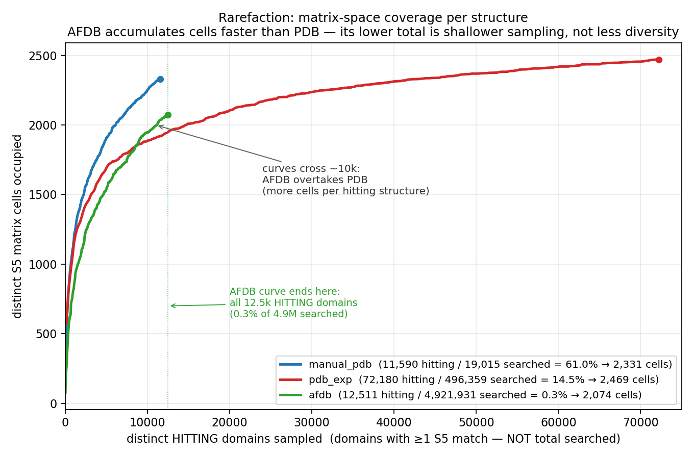

# Where the S5 negative space lands

## Follow-up: from an 800-query hole to a saturation measurement

*The first deck ended with the 800-query whole-skeleton negspace holding at zero across 5.4M structures, and the full 6,336-cell sweeps in flight. They are now complete. We then ran every fold-novelty probe we could reach — AFDB dark matter, TED novel folds, and a multi-filter annotation funnel — through the same S5 instrument. All land on known geometry. One probe looked like it broke the pattern; it turned out to be a methodological trap worth stating carefully, because it is the objection a skeptic will raise.*

<!-- Notes: This is the closing arc. Deck 1 = enum + negspace + four bugs. Deck 2 = full landscape done, the negative reframed as a positive claim, the novelty gauntlet, and the one controlled experiment that seals it. Audience: lab + Jimin, who now has the interactive inspector. -->

---

# Recap — where deck 1 left off

- **Enumeration**: 198 S5 skeletons × 32 H/E typings = **6,336 queries** from the Chitturi 2016 2D-hex-lattice model.
- **Whole-skeleton negspace**: 25 skeletons (800 queries) return zero across *every* typing.
- **Scale-up test**: 800 queries × (19k curated + 496k experimental PDB + 4.9M AFDB) = **2,400 sweeps, 0 lit-up**. Not one negspace motif is realized at 5.4M structures.
- **Cost**: four latent `searchmatrix` buffer/validation bugs, all fixed.
- **Then in flight**: the full 6,336-cell sweeps + the interactive inspector.

> Deck 2 picks up exactly here: the sweeps finished, and the question became *how far does the negative generalize?*

<!-- Notes: One-slide bridge so this deck stands alone. The 800 = whole-skeleton-zero (strict). The full landscape introduces the per-CELL negspace, a superset. Keep those two numbers distinct on the next slide. -->

---

# The full landscape is in — four databases, one matrix

| Dataset | Searched | Occupied cells | Kind |
|---|---:|---:|---|
| ECOD manual reps | 19,015 | 2,328 | experimental |
| Full experimental PDB (ECOD domains) | 496,359 | 2,466 | experimental |
| AFDB non-singleton reps — ECOD-assigned | 4,921,931 | 2,074 | predicted |
| AFDB non-singleton reps — unassigned | 787,509 | 786 | predicted |

- **3,380 of 6,336 cells stay empty** across all four (the per-cell negspace; a superset of the 800 whole-skeleton holes).
- All browsable in the inspector: heatmaps, per-cell exemplars rolled up by ECOD T-group, real per-pair contact geometry, all-pairs compositional enrichment.

<!-- Notes: 3,380 is the per-cell union-of-absence; 800 is the strict whole-skeleton version. Occupied union ≈ 2,956 cells. The inspector is the deliverable Jimin gets — leda:3001/docs. -->

---

# The reframe — the negative *is* the result

- S5 is an **assignment-free instrument**: pure SSE geometry, fully enumerable, so it comes with a **denominator** (6,336). That makes "what's missing" a measurable quantity, not an anecdote.
- A novelty test built on CATH/ECOD begs the question (novel = "we didn't classify it"). S5 does not.
- **The claim**: the observable 5-SSE fold repertoire is effectively *closed*. AlphaFold multiplies the **membership** of known folds by orders of magnitude but adds essentially **no new local topology**.

> Sequence space is exploding; it maps many-to-one onto a bounded, nearly-filled fold codomain that stopped growing orders of magnitude of sequence ago. AF is the lens that lets you see the collapse.

<!-- Notes: This is the thesis. "Saturation measurement" not "we failed to find novelty." The many-to-one framing is the paper's spine and reframes ECOD's value: AF maps divergent members back to a reference — good news for classification, not a threat. -->

---

# AFDB is diverse per structure — but bounded

- AFDB accumulates matrix cells *faster per hitting structure* than PDB, and overtakes it by ~10k structures.
- PDB is redundant: 72k structures → ~2,469 cells, long plateaued.
- AFDB's lower **total** occupancy is shallower sampling, **not** less diversity — and it still tops out inside the same 6,336-cell space.

<!-- Notes: Pre-empts "but AFDB is bigger/more diverse." Yes per-structure, but the ceiling is the same enumerable space. Diversity != new topology. -->

---

# The novelty gauntlet — every probe we could reach

Each pushes a differently-defined "new fold" set through the *same* S5 instrument.

| Probe | Set (how "novel" is defined) | Result at S5 |
|---|---|---|
| Whole-skeleton negspace | 800 lattice motifs, never seen | 0 / 2,400 sweeps at 5.4M |
| AFDB dark matter | unassigned AFDB reps (no ECOD) | under-hits; 786 cells, 96% PDB-known |
| TED novel folds | 7,427 curated, **no CATH match** | 89% PDB-occupied; **1** robust novel |
| Annotation funnel (v3) | 4,201 dark clusters, multi-filter | whole-model 40 → **domain-chopped 0** |

- Four independent definitions of novelty — geometric, dark-sequence, no-CATH, and annotation-filtered.
- **All land on known S5 geometry.** The one apparent exception (v3) is a methodological artifact — next slides.

<!-- Notes: This table IS the deliverable the user asked to enumerate. Note the definitions are genuinely different and non-circular w.r.t. S5 (which is classification-independent). TED is the strongest single point: most-curated fold-novelty set in existence, still 89% geometrically known. -->

---

# Probes 1–2 — dark matter and TED novel folds

**AFDB dark matter** (sequence-dark ≠ fold-dark):
- ~16% of the DB but only ~4% of hits — it *under*-hits S5.
- 786 occupied cells, 96% already PDB-known; ~16 novel-vs-all-known, all singletons.

**TED novel folds** (defined by *no CATH match* — a classification-based novelty claim):
- 89% land on PDB-occupied cells.
- Exactly **1** robust (multi-structure) novel cell: skeleton 118 / EEHHE.
- Non-circular: S5 knows nothing about CATH, yet agrees the geometry is known.

> Even the most-curated fold-novelty set on the planet is, at the 5-SSE level, geometry we have already seen.

<!-- Notes: The spine finding. Sequence divergence and classification-novelty both dissociate from geometric novelty. The TED "1 robust" is the honest residual — reported, not hidden. -->

---

# Probe 3 — the annotation funnel, and the trap

- `~/work/afdb_200M` GENUINE funnel: dark clusters → no-Pfam → no-CATH → no-InterPro → pLDDT≥70 → low-decay → not-prophage → ≥10 members. **4,201** "genuine novelty" candidate domains.
- Searched as **whole multi-domain models**, they appear to hit **40 robust never-seen cells** (top: HEEHE, 6 independent proteins) — the *only* probe to break the pattern.
- **The catch**: those motifs draw their five SSEs from *scattered positions across a whole protein* (median span 234 res vs 153 for known-cell hits) — i.e. **across domain boundaries**. An arrangement a domain-chopped reference search *structurally cannot produce*.

> The reference databases were searched as **chopped domains**; v3 was searched as **whole models**. That granularity mismatch — not novelty — manufactures never-seen cells.

<!-- Notes: This is the honest "we almost fooled ourselves" slide. The 40 robust cells were real matches, but cross-domain. The right comparison must match input granularity. This is exactly the objection a ProSMoS partisan raises, so we ran the controlled experiment. -->

---

# The sealing test — a controlled A/B

Chop each candidate to **its own committed `_D<n>` domain boundary** (the pipeline's own decomposition — no arbitrary cutoff), rebuild with the **identical PALSSE + generateMatrix pipeline**. Only one variable changes: chopping.

| | whole-model v3 | domain-chopped v3 |
|---|---:|---:|
| occupied cells | 2,063 | 982 |
| total hits | 96,191 | 16,981 |
| never-seen cells | 150 | 25 |
| **never-seen w/ ≥2 proteins** | **40** | **0** |

- The 40 robust "novel" cells → **0**. The 25 residual never-seen cells are all singletons (noise floor).
- **Lesson for the paper**: whole-model vs domain-chopped input must be matched, or cross-domain SSE assembly masquerades as fold novelty.

<!-- Notes: Unimpeachable because (a) boundaries are the pipeline's own, not a cutoff we chose, and (b) it's a within-v3 A/B holding SSE-method fixed. This retires the "you cherry-picked the compact filter" objection. Builds at ~/work/prosmos_2026/{v3_dom,s5_v3_dom}. -->

---

# When to trust S5 — the instrument's own limits

- **Composition-graded fidelity**: within-cell 5-SSE geometry tightens monotonically with strand count (~−1.9 Å/strand); a **1-strand penalty** — all-α / single-strand cells are grab-bags, β-registration makes a cell determinate.
- **It's baked into the query, not just the structures**: an `EEEEE` query carries ~700 hard `-` (non-contact) constraints + ~1,000 sheet-pairing codes (`c`/`t`) across the 198 skeletons; `HHHHH` is ~854 `X` wildcards with **zero** hard constraints. Same-sheet non-adjacent strands *cannot* touch (register-separated) → `-`; non-adjacent helices are unconstrained → `X`. So all-α cells are intrinsically *looser* queries and match promiscuously — the fidelity gradient is half structural, half encoding.
- **Blind to transmembrane**: GPCR (5001.1.1) and MFS (5050.1.1) — maximally different TM folds — both land in generic `HHHHH` cells.
- **Tiling inflates abundance**: ARM repeats (109.4.1) — one domain hits up to 123 cells. Abundant ≠ novel; controlled by compositional (share-of-hits) normalization.

<!-- Notes: Method introspection = credibility. We state where the descriptor is strong (β-rich) and where it's a grab-bag (all-α). The encoding bullet: the -/X asymmetry is NOT our invention. Vocabulary is paper §1.1.1 verbatim ("Non adjacent SSEs can either interact optionally (X) or not interact at all (-)"); the assignment rule (same-sheet non-adj strand -> '-', else -> 'X') exactly reproduces the CG-2012 oracle -- verified 0 violations across 2,807 IA-S5.txt records (2,766 '-', 13,132 'X'). It's physically forced: same-sheet non-register-adjacent strands are separated by intervening strands, can't contact -> hard '-'; helices/cross-sheet unconstrained -> wildcard 'X'. So all-helix cells are looser QUERIES, reinforcing the determinism/promiscuity gradient from the query side. TM-invisibility and ARM-tiling are the two cautionary examples; compare view is compositional, not per-structure rate. -->

---

# Where it lands

- **"ECOD is completed" — bounded to three regimes**: (1) the common core is discovery-complete; (2) the frontier moved from *discovery* to *membership* (AF = remote-homology-at-scale); (3) the tail is curation-hard, not discovery-rich (repeats, symmetry, ARM).
- **Honest limits, in the paper**: S5 is a *local, offset, fixed-cardinality* descriptor (Lesk) — claims are about 5-SSE motif space; an empty cell means "never observed here," not "unfoldable."
- **Still open**: are the 3,380 empty cells sterically reachable-but-untaken, or lattice over-generation? Resolution needs constructive 3D backbone modeling (RFdiffusion / Rosetta) on the negspace.

<!-- Notes: The careful version of "we're done." Three regimes so nobody hears "protein folding is solved." The reachability question is the same open item as deck 1 — unchanged, because it's genuinely constructive-modeling territory, not more searching. -->

---

# Recap

- **Full landscape done**: 6,336 cells × 4 databases; 3,380 stay empty; all in the interactive inspector.
- **The negative reframed**: a saturation measurement with an assignment-free, enumerable instrument — the observable 5-SSE repertoire is effectively closed.
- **Novelty gauntlet**: four independent novelty definitions (lattice, dark-sequence, no-CATH, annotation-funnel) → all land on known geometry.
- **The one trap**: whole-model search fabricated 40 "novel" cells; a controlled domain-chopped re-search collapsed them to 0. Input granularity, not topology.
- **Deliverables**: inspector (`leda:3001/docs`), sealed capstone, full session log.
- **Open**: geometric reachability of the 3,380 — constructive modeling, not more search.

<!-- Notes: One-slide close. Order: what finished, the claim, the gauntlet, the trap+seal, deliverables, the single remaining open question. -->
